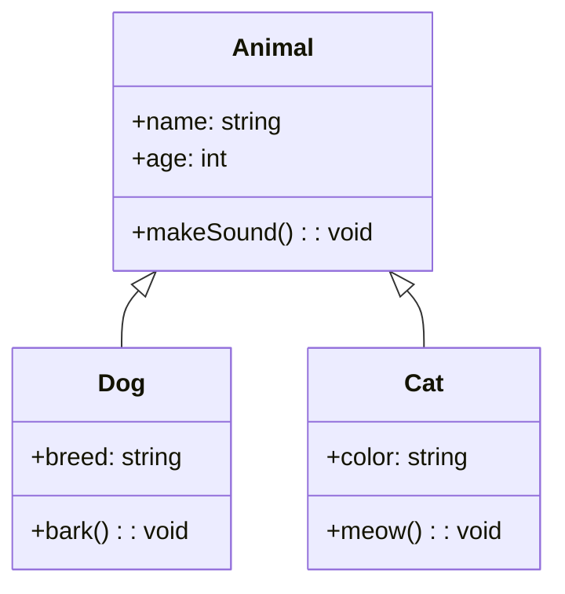
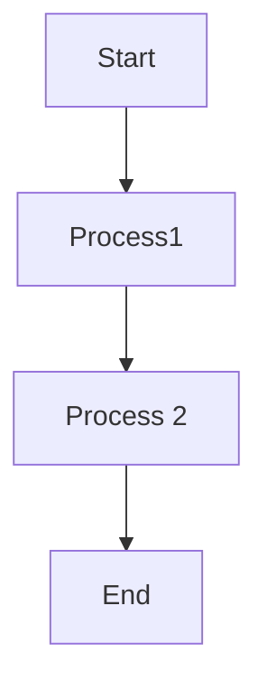

# How to Create a Class Diagram
- Class diagrams are used to visualize the structure and relationships of classes, interfaces, and their interactions in object-oriented programming (OOP). You can render class diagrams in Mermaid using this syntax:

## Syntax breakdown:
- sequenceDiagram: This keyword specifies that we are making a sequence diagram.
- participant: These are the participants or the actors in a sequence diagram.
- activate/ deactivate: It is possible to activate and deactivate an actor. Activation shows as a small rectangle between interactions.
- -->>: Connecting lines (dashed).
- ->: Connecting lines (solid).
- 



# How to Create a Flowchart

- A flowchart is a picture that shows the steps of a process using symbols, helping to explain the process in a clear and organized way. A flow chart is composed of nodes that are connected by arrows.
- You can render flowcharts in mermaid using this example:


## How to Generate Diagrams as Code with Mermaid

- Mermaid is a JavaScript-based tool that transforms Markdown-style text into dynamic diagrams, allowing you to create and modify them effortlessly.
- Mermaid makes it easy to generate diagrams and visuals using simple text and code.
- It follows a simple syntax:

```mermaid
	your code goes here
    .
    .
    .
    
```

- With Mermaid, you can generate the following diagram types:
- Flowchart
- Sequence Diagram
- Class Diagram
- Gantt
- Pie Chart

## Let's explore them one by one

